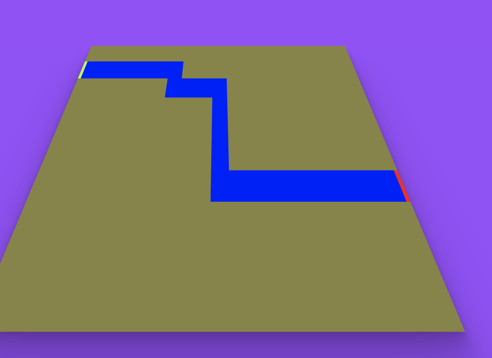
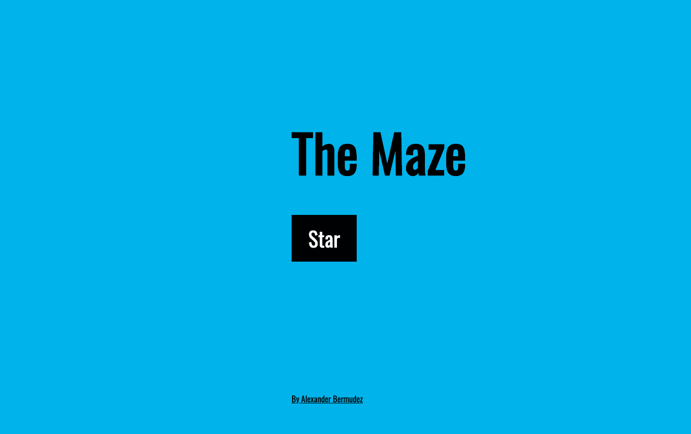
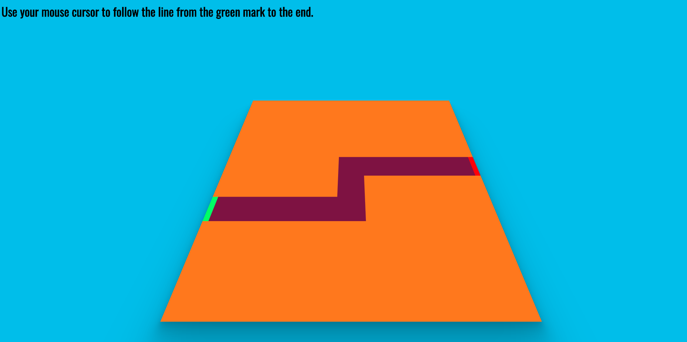

## The Maze
## Concept: 
This is a maze game where you follow a path with your mouse while trying not to move the mouse oustide of the path. In order to complete each level you will start on the green line of the maze and move the mouse through the path until you reach the red line. You have 10 lives for the all 4 levels of the game, so try to be really careful. 
## Technologies Used:
    - HTML
    - CSS
    - JQuery 
    - CSS 
    - Sweetalert2
## Approach: 
The main element in the game is the maze, this element was acomplished creating a matrix of div with a property of mouse over, I defined the path of the levels with arrays so it will be easy to add more levels in the future.
## Challenges: 
    -Make the metrix of divs with the mouse over function.
    -Make each level in base a array that defines the function on a array.
    -Keep track of when the mouse goes in the path in the correct way 
## Additional information:
Early state in the develoment

Main Menu

First level

## App Demo 
Please take a look at my project hosted on Gifhub
https://alexber17.github.io/
# Alexber17.github.io
